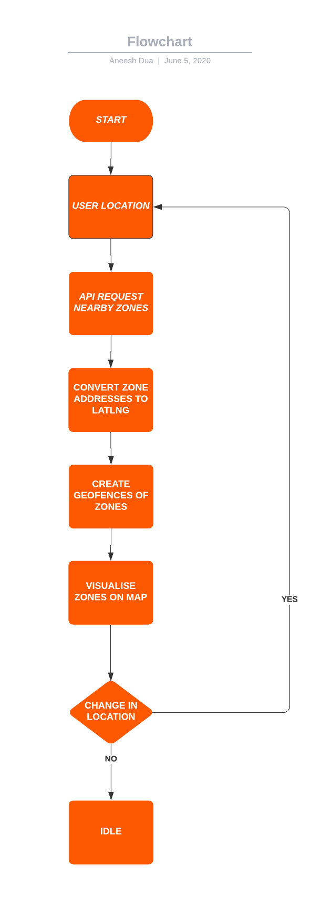

# COCOA
 <b>CO</b>VID <b>CO</b>ntainment <b>A</b>lert Android Application uses User's Location and visualises containment zones(if any) within a 5km radius. It updates the zones as the User's Location changes.
    
## Flowchart
The following diagram explains the flow of the app and its data amongst various classes and methods. 

## APIs Used

### Google Places (Maps) API
The app uses this API to get user's current location. Apart from the latter, this API is also used for **Reverse-Geocoding** and **Geofencing** functionalities.

Link: https://developers.google.com/places/web-service/intro

### GeoIQ Covid Containment Zone API
The app gets the latest containnment zones data from this API. The API allows for 200 requests per day to the app. The data contains zones of select cities as of the time of writing this document. More and more cities are being added daily to the database. Retrofit library and Kotlin coroutines were used to send synchronous API requests.

Link: https://www.geoiq.io/covid19.html
 
  
## Architecture Overview

### Maps Activity
This is the main activity which contains the maps view. It reflects User's location and the alert messages for the user. It also contains the **Reverse Geocoding** as well as **Geofencing** functions.

### Containment Zones
This Kotlin class is mainly for generating and implementing API requests to the GeoIQ API for receiving nearby containment zones name. It uses Kotlin concepts data class and coroutines.

### GeoFenceErrorMessages
This Kotlin file contains error message functions which display the respective error messages.
   
## Testing Method

Since the application uses Google Places API for user location, Google Play Services sign in is **mandatory** for the app. An active Internet connection is also required for getting the nearby Containment Zones.

If testing in Android Studio Emulator, Set Location using Extended Controls option and tap the location button.
