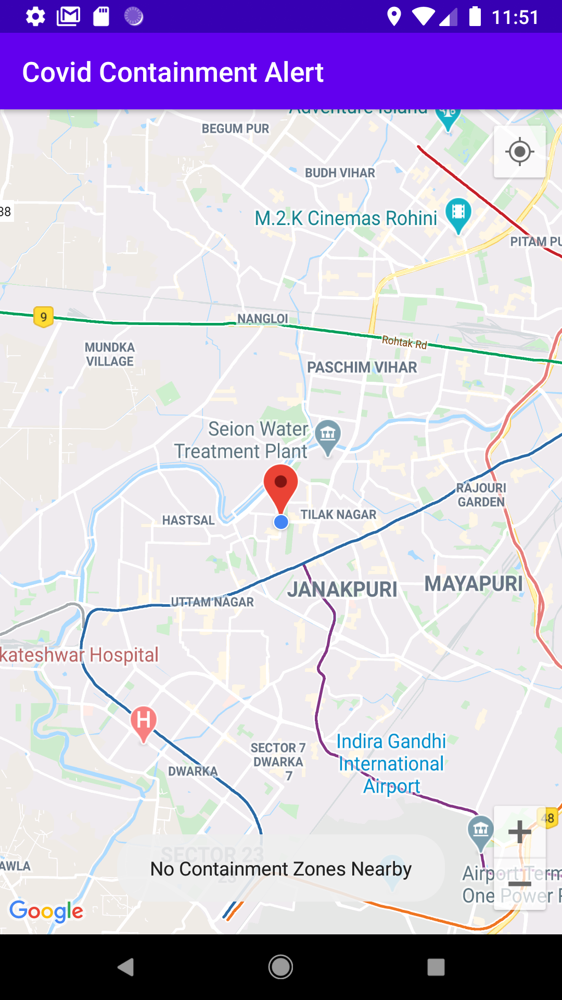
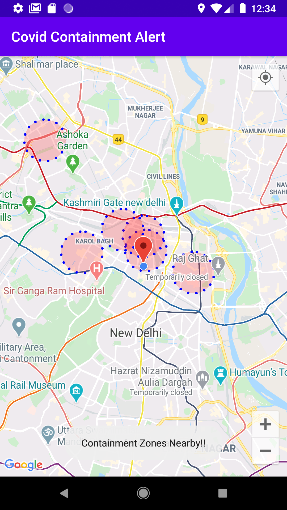

#  COCOA

<h2 align="left">COVID Containment Alert</h2>
  
COCOA is an Android app that keeps users updated with the **CO**VID **CO**ntainment zones in their vicinities. [According to the Health Ministry of India,](https://www.mohfw.gov.in/pdf/Containmentplan16052020.pdf)
>A Covid Containment Zone refers to a specific geographical area where positive cases of coronavirus are found. Strict movement restrictions are put in place in such areas to prevent further spread of the virus.

COCOA updates zones with changing User's Location.The database currently supports the following cities/regions in India

1. Delhi NCR
2. Pune
3. Indore
4. Jaipur
5. Chandigarh
6. Bangaluru
7. Chennai
8. Kolkata
9. Mumbai
10. Surat

More regions are being added daily to the database which shall automatically reflect in the app without any changes to its build.

## Inspiration
COCOA was developed as a beginner project for 30 Days of Kotlin event of Google Devs India. It has been made completely by me during the month of May, 2020. I developed this Application in order to learn Android Development using Kotlin along with the wish to contribute to a real-time use case. This app will be useful to increase awareness and inform status of Containment Zones to the people. Also, as the country comes out of lockdown, people will know which areas to avoid while travelling.

## Development Specifications

* IDE - **Android Studio 3.6.3**
* Language - **Kotlin 1.3.72**
* Test Device - Pixel 2 API 27
* Minimum Android Version - Nougat(Android 7.1.1)

## Contribution
### Getting Started
To setup the project on your machine, clone this repository and import project directory *COCOA* into **Android Studio**.

### Development Status
This App is still not published on the Google Play Store. It needs ironing out the legality aspects pertaining to the user's location and sponsership for the using the Backend API. 

## Screenshots

## Kotlin And Android Concepts Used
* Null Safety
* Data Classes
* View Model
* Coroutines
* Android KTX
* Mutable Live Data

## Device Permissions Required
* INTERNET
* FINE LOCATION

## License

This project is licensed under the MIT License - see the [LICENSE.md](LICENSE.md) file for details

## Author
Aneesh Dua

## Contact me:
* Email - aneeshdua@gmail.com
* Twitter - https://twitter.com/aneeshdua
* LinkedIn - https://www.linkedin.com/in/aneesh-dua-b6160b151/

